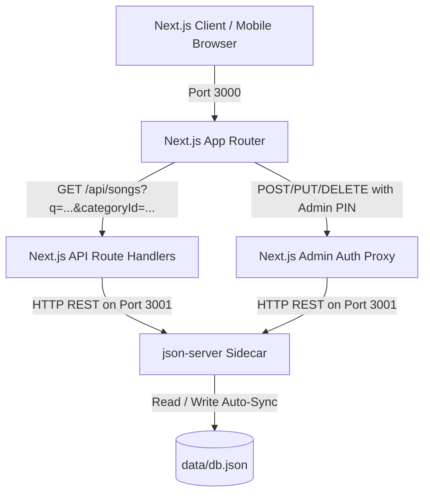

# Product & Technical Specification: Digital Sångbok (Songbook Web App)

**Version:** 2.1.0  
**Status:** Approved  
**Target Audience:** Friends, family, party guests, dinner hosts / toastmasters, and administrators.

---

## 1. Executive Summary & Vision

The **Digital Sångbok** is a modern, mobile-first responsive web application tailored for social gatherings, dinner parties, kräftskivor, midsommar feasts, and student festivities. It allows guests to easily search, browse, and sing traditional Swedish snapsvisor and drinking songs together with zero friction, instant load times, and crystal-clear readability.

The backend data architecture is powered by a **`json-server` REST API sidecar** operating on `data/db.json`, securely proxied and authenticated by Next.js API routes.

Features are structured across three clear priority phases:
- **Phase 1 (MVP / P0): The Lean MVP (Pure Songbook Experience)** — Fast, lightweight sing-along experience with debounced server-side query search, font sizing, category filtering, and direct links.
- **Phase 2 (P1): Admin Management & Power Features** — PIN-protected song/category CRUD via Next.js proxy, QR code table sharing, favorites bookmarking, screen wake lock, and dark/light theme switching.
- **Phase 3 (P2 & P3): Party Enhancements & Event Booklets** — Custom curated event booklets (*sånghäften*), category deletion reassignment wizard, offline PWA support, and printable PDF export.

---

## 2. Feature Prioritization Matrix & Roadmap

| Phase | Priority | Feature | Description | Target User Value |
| :--- | :---: | :--- | :--- | :--- |
| **Phase 1: Lean MVP** | **P0** | **Curated Song Catalog** | 25+ essential Swedish snapsvisor, seasonal songs (Kräftskiva, Midsommar, Jul), beer/student songs, and classics in `data/db.json`. | Zero setup required; instant access to beloved party classics. |
| **Phase 1: Lean MVP** | **P0** | **Sing-Along Lyric View** | Large-format typography, clear verse spacing, high contrast, and prominent "Melodi: ..." banner. | Maximum legibility when singing around dinner tables. |
| **Phase 1: Lean MVP** | **P0** | **One-Tap Font Sizing** | `A-` / `A+` font scaling stepper with browser persistence (`localStorage`). | Quickly adapts text size for varying eyesight and table distances. |
| **Phase 1: Lean MVP** | **P0** | **Server-Side Search & Filters** | Real-time query param search (`/api/songs?q=...&categoryId=...`) routed to `json-server` full-text search with category filter chips. | Find any song in under 2 seconds when someone calls for a toast. |
| **Phase 1: Lean MVP** | **P0** | **Direct Shareable URLs** | Unique route `/visa/[slug]` with previous/next navigation buttons using slug-based IDs. | Direct sharing in group chats (WhatsApp, SMS, Messenger). |
| **Phase 1: Lean MVP** | **P0** | **`json-server` REST Data Store** | Standalone `json-server` process on port 3001 watching `data/db.json`, proxied by Next.js API routes on port 3000. | Real-time JSON REST persistence and synchronized catalog. |
| **Phase 2: Power Features** | **P1.1** | **Admin Song CRUD** | PIN-protected admin portal (`/admin`) to Add, Edit lyrics/melodies/tags, and Delete songs via authenticated proxy routes. | Toastmaster/host can customize songs and add inside jokes. |
| **Phase 2: Power Features** | **P1.2** | **Admin Category Management** | Create and edit custom themes (e.g. *Nyår 🍾*, *Bröllop 💍*, *Valborg 🔥*), emojis, and badge colors. | Customizes categories for specific events and seasons. |
| **Phase 2: Power Features** | **P1.3** | **Table QR Code Sharing Modal** | One-tap button on any song generating a clean, scannable QR code. | Table mates point their phone camera at the screen to open song instantly. |
| **Phase 2: Power Features** | **P1.4** | **Favorites Bookmarking (⭐)** | Star songs saved locally in browser `localStorage` with a dedicated "⭐ Mina favoriter" filter. | Guests keep their go-to snapsvisor 1 tap away throughout the night. |
| **Phase 2: Power Features** | **P1.5** | **Screen Wake Lock API** | Keeps phone displays awake while viewing song lyrics via `navigator.wakeLock`. | Eliminates phones dimming or locking mid-song. |
| **Phase 2: Power Features** | **P1.6** | **Theme Switcher (Dark / Light)** | Warm festive tavern dark mode vs. crisp daylight parchment mode. | Optimal contrast in dim candlelight or bright daylight. |
| **Phase 3: Enhancements** | **P2.1** | **Custom Event Booklets (*Sånghäften*)** | Curate an ordered playlist/booklet for a specific event (e.g. *"Midsommar 2026"*, *"Kräftskiva hos Anna"*). | Host guides the party through a scheduled set of songs. |
| **Phase 3: Enhancements** | **P2.2** | **Category Deletion Safety Reassignment** | Interactive wizard to reassign songs to another category before deleting a category. | Prevents orphaned songs and accidental data loss. |
| **Phase 3: Enhancements** | **P2.3** | **Offline PWA Support** | Service worker caching and manifest for full offline capability. | Works smoothly at remote summer cottages (*sommarstugor*) without cell coverage. |
| **Phase 3: Enhancements** | **P3.1** | **Printable PDF Export** | Formatted 2-column printable paper booklet generator. | Physical backup booklet for traditional table settings. |

---

## 3. Core Personas & User Stories

### 3.1 Personas
- **The Party Guest (Sing-along User):** Needs to open the app on mobile in a dimly lit room, read lyrics clearly without the screen sleeping, adjust font sizes instantly, and star go-to songs.
- **The Toastmaster / Admin Host:** Wants to curate the song catalog and category themes, create custom songs or event booklets, and share songs quickly across tables via QR codes.

### 3.2 Prioritized User Stories

#### Phase 1: MVP (P0)
- **US-1 [P0 - Browse & Filter]:** As a guest, I want to filter songs by category chips (Snaps, Kräftskiva, Midsommar, etc.) querying `json-server` via `/api/songs?categoryId=[id]`.
- **US-2 [P0 - Server-Side Search]:** As a guest, I want to type in the search bar and query `json-server` (`/api/songs?q=[term]`) with debounced inputs.
- **US-3 [P0 - Sing-Along Lyric View]:** As a singer, I want large high-contrast lyrics with distinct verse spacing and a prominent "Melodi:" subtitle.
- **US-4 [P0 - Dynamic Font Sizing]:** As a user, I want `A-` / `A+` buttons to resize text on the fly, with my preferred size saved in `localStorage`.
- **US-5 [P0 - Shareable Deep Links]:** As a user, I want shareable URLs (`/visa/[slug]`) mapping directly to song IDs in `json-server`.
- **US-6 [P0 - json-server Database & Dev Workflow]:** As a developer, I want `npm run dev` to start both Next.js (port 3000) and `json-server` (port 3001) watching `data/db.json`.

#### Phase 2: Priority 1 Extras (P1)
- **US-7 [P1.1 - Admin Song CRUD]:** As an admin, I want to log into `/admin` with a secure PIN to add, edit (with live preview), and delete songs via Next.js proxy routes that forward mutations to `json-server`.
- **US-8 [P1.2 - Admin Category Management]:** As an admin, I want to create and edit categories with custom emojis, titles, and color badges.
- **US-9 [P1.3 - Table QR Code Sharing]:** As a guest, I want to display a full-screen QR code modal for any song so table mates can scan it with their camera.
- **US-10 [P1.4 - Local Favorites]:** As a guest, I want to star songs and access a "⭐ Mina favoriter" filter tab saved in my browser.
- **US-11 [P1.5 - Screen Wake Lock]:** As a singer, I want my phone screen to stay illuminated while viewing lyrics so it doesn't turn off mid-toast.
- **US-12 [P1.6 - Dark/Light Theme]:** As a user, I want to toggle between Nordic Tavern dark mode and Parchment light mode.

#### Phase 3: Priority 2 & 3 Extras (P2 / P3)
- **US-13 [P2.1 - Event Booklets / Sånghäften]:** As a host, I want to build a custom ordered song list for a party with a dedicated shareable booklet URL stored under `"booklets"` in `json-server`.
- **US-14 [P2.2 - Category Reassignment Wizard]:** As an admin deleting a category, I want a wizard prompting me to reassign existing songs to another category before deleting from `json-server`.
- **US-15 [P2.3 - Offline PWA Support]:** As a user at a summer cottage with poor reception, I want the web app to load and function completely offline.
- **US-16 [P3.1 - Printable PDF Export]:** As a host, I want to export an event booklet or song catalog as a printable 2-column A4 PDF.

---

## 4. Architecture & Technical Stack



| Layer | Technology | Priority / Phase | Purpose |
| :--- | :--- | :---: | :--- |
| **Framework** | Next.js 16 (App Router) | **P0** | Server & client components, API routes (port 3000), proxying, SEO/metadata |
| **Backend Mock REST** | `json-server` (v0.17.4) | **P0** | Sidecar REST API running on port 3001 watching `data/db.json` |
| **Process Orchestration**| `concurrently` | **P0** | Concurrently runs `next dev` and `json-server` via single `npm run dev` |
| **UI Library** | React 19 + TypeScript | **P0** | Strict type safety, responsive component hierarchy, and reactive state |
| **Styling** | Tailwind CSS v4 | **P0** | Responsive design, dark/light theme tokens, fluid typography |
| **Icons** | Lucide React | **P0 / P1** | UI icons (search, star, QR, text size, wake lock, edit, trash, tag, chevron) |
| **Data Persistence** | `data/db.json` | **P0 / P1** | Single unified JSON database committed to Git (`songs`, `categories`, `booklets`) |
| **Client Storage** | Browser `localStorage` | **P0 / P1** | Offline favorite bookmarks and user font size preferences |
| **QR Generation** | `qrcode.react` / SVG generator | **P1** | Lightweight client-side QR code generation for table sharing |
| **Admin Auth** | PIN / Passcode + Session Cookie | **P1** | Next.js server validates PIN before mutating `json-server` records |
| **Browser APIs** | Screen Wake Lock API (`navigator.wakeLock`) | **P1** | Prevents mobile screen dimming/sleeping during singing |
| **PWA / Service Worker** | `next-pwa` / Serwist | **P2** | Asset & data caching for zero-connection summer cabins |
| **PDF Generation** | `@react-pdf/renderer` or print CSS | **P3** | Formatted 2-column printable paper songbook |

---

## 5. Data Model & Database Schema (`data/db.json`)

### 5.1 JSON Database Schema

```json
{
  "categories": [
    {
      "id": "snaps",
      "name": "Snapsvisor",
      "emoji": "🥃",
      "color": "amber",
      "description": "Klassiska visor till nubben",
      "order": 1
    }
  ],
  "songs": [
    {
      "id": "helan-gar",
      "slug": "helan-gar",
      "title": "Helan Går",
      "melody": "Helan går",
      "categoryId": "snaps",
      "lyrics": [
        "Helan går,",
        "sjung hopp faderallan lallan lej,",
        "helan går,",
        "sjung hopp faderallan lej.",
        "Och den som inte helan tar,",
        "han ej heller halvan får.",
        "Helan går...",
        "[Skål!]"
      ],
      "tags": ["snaps", "nubbe", "klassiker"],
      "notes": "Skålas efter sista raden!",
      "language": "sv",
      "createdAt": "2026-09-01T00:00:00.000Z",
      "updatedAt": "2026-09-01T00:00:00.000Z"
    }
  ],
  "booklets": []
}
```

### 5.2 TypeScript Interfaces (`types/song.ts`)

```typescript
export type CategoryColor = 'amber' | 'red' | 'green' | 'blue' | 'purple' | 'slate';

export interface Category {
  id: string;              // e.g. "snaps", "kraftskiva", "midsommar"
  name: string;            // e.g. "Kräftskiva"
  emoji: string;           // e.g. "🦞"
  color: CategoryColor;    // Color theme badge
  description?: string;
  order: number;           // Display ordering
}

export interface Song {
  id: string;              // Slug used as ID (e.g. "helan-gar")
  slug: string;            // Matching URL slug (e.g. "helan-gar")
  title: string;           // Display title (e.g. "Helan Går")
  melody?: string;         // Name of melody (e.g. "Helan går" or "Mors lilla Olle")
  categoryId: string;      // References Category.id
  lyrics: string[];        // Array of lines or stanzas formatted with line breaks
  tags: string[];          // Search tags (e.g. ["snaps", "nubbe", "klassiker"])
  notes?: string;          // Ritual hints (e.g. "Skålas efter sista raden!")
  language: 'sv' | 'en';   // Song language
  createdAt?: string;      // ISO timestamp
  updatedAt?: string;      // ISO timestamp
}

export interface SongFormData {
  title: string;
  slug?: string;
  melody?: string;
  categoryId: string;
  lyricsText: string;      // Multi-line textarea input
  tagsText: string;        // Comma-separated tags
  notes?: string;
  language: 'sv' | 'en';
}

export interface CategoryFormData {
  name: string;
  slug?: string;
  emoji: string;
  color: CategoryColor;
  description?: string;
  order?: number;
}

export interface SongBooklet {
  id: string;              // e.g. "midsommar-2026"
  slug: string;            // URL slug (e.g. "midsommar-2026")
  title: string;           // e.g. "Midsommarafton hos familjen Svensson"
  description?: string;
  eventDate?: string;      // ISO date string
  songIds: string[];       // Ordered list of Song IDs
  createdAt: string;
  updatedAt: string;
}
```

---

## 6. Functional Specifications by Phase

### 6.1 Phase 1: The Lean MVP (P0)

#### 1. Curated Song Catalog in `data/db.json`
- Preloaded with 25+ classic Swedish snapsvisor and party songs across core categories:
  - 🥃 **Snapsvisor** (*Helan Går*, *Halvan*, *Tersen*, *Kvarten*, *Mera Brännvin*, etc.)
  - 🦞 **Kräftskiva** (*Kräftan lyser röd på fatet*, *När kräftorna är kokta*, etc.)
  - 🌸 **Midsommar** (*Små grodorna*, *Sommarpsalm*, etc.)
  - 🎄 **Jul & Vinter** (*Nu är det jul igen*, *Hej tomtegubbar*, etc.)
  - 🍺 **Öl & Studentvisor** (*O, gamla klang och jubeltid*, *Strejk på Eriksdal*, etc.)

#### 2. Sing-Along Lyric View (`/visa/[slug]`)
- Large, bold title and prominent `Melodi: [Melodititel]` banner.
- High-contrast typography with generous line height and stanza spacing.
- Ritual/toast callouts (*"Skålas efter sista raden!"*).
- Navigation footer: `← Föregående visa` and `Nästa visa →` with keyboard arrow support.

#### 3. One-Tap Font Sizing
- Sticky or header-integrated `A-` / `A+` font size control (4 steps: Normal, Large, X-Large, Huge).
- Preference stored in browser `localStorage` and applied consistently across song views.

#### 4. Server-Side Query Search & Category Filter
- Debounced search query dispatched to Next.js API `/api/songs?q=[term]&categoryId=[id]`, which passes query parameters to `json-server` on port 3001.
- Category chip bar with active state indicator and song count badges.
- Loading indicator during search transitions.

#### 5. Developer Workflow & Sidecar Scripts
- `npm run dev`: Runs `concurrently "next dev -p 3000" "json-server --watch data/db.json --port 3001"`
- `npm run dev:next`: Starts only Next.js
- `npm run dev:server`: Starts only `json-server`

---

### 6.2 Phase 2: Priority 1 Extras (P1)

#### 1. Admin Song Management (P1.1)
- Protected `/admin` dashboard requiring PIN entry.
- Next.js API route validates PIN session cookie before executing `POST`, `PUT`, or `DELETE` to `json-server`.
- `SongFormModal` featuring live side-by-side lyrics preview, auto-slug generator, and category selector.

#### 2. Admin Category Management (P1.2)
- Category management tab in `/admin`.
- `CategoryFormModal` featuring emoji presets (🥃, 🦞, 🌸, 🎄, 🍺, 🍾, ☕, 🎂, 💍, 🎓, 🎸, ☀️) and color badge selector.

#### 3. Table QR Code Sharing Modal (P1.3)
- "Dela med bordet" button on every song view opening a full-screen QR code linking to current `/visa/[slug]`.

#### 4. Favorites Bookmarking (P1.4)
- Star toggle button (⭐) on catalog song cards and song detail view stored in `localStorage`.
- "⭐ Mina favoriter" filter tab on the home catalog page.

#### 5. Screen Wake Lock (P1.5)
- Automatically requests `navigator.wakeLock.request('screen')` on song lyric page mount with visual badge indicator (*"Skärmen hålls vaken"*).

#### 6. Dark & Light Theme Switcher (P1.6)
- Toggle between **Nordic Tavern (Dark)** and **Parchment (Light)** modes.

---

### 6.3 Phase 3: Priority 2 & 3 Extras (P2 / P3)

#### 1. Custom Event Booklets / Sånghäften (P2.1)
- Host can create named booklets stored in `data/db.json` under `"booklets"`.
- Dedicated guest view `/hafte/[slug]` that walks through songs in order.

#### 2. Category Deletion Safety Reassignment (P2.2)
- Wizard checking if songs reference `categoryId` and prompting admin to reassign songs before executing DELETE.

#### 3. Offline PWA Support (P2.3)
- Manifest file and Service Worker caching app shell and static responses.

#### 4. Printable PDF Export (P3.1)
- Generates a 2-column formatted printable A4 PDF booklet with table of contents.

---

## 7. Next.js Proxy API Endpoints

All client requests communicate with Next.js on port 3000, which proxies to `json-server` on port 3001:

| Method | Next.js API Route | Upstream `json-server` Target | Phase | Auth | Purpose |
| :--- | :--- | :--- | :---: | :---: | :--- |
| `GET` | `/api/songs?q=&categoryId=` | `http://localhost:3001/songs?q=&categoryId=` | **P0** | Public | Queries songs with filters |
| `GET` | `/api/songs/[id]` | `http://localhost:3001/songs/[id]` | **P0** | Public | Returns single song by ID/slug |
| `GET` | `/api/categories` | `http://localhost:3001/categories?_sort=order` | **P0** | Public | Returns all categories |
| `POST` | `/api/songs` | `http://localhost:3001/songs` | **P1** | Admin PIN | Proxies song creation |
| `PUT` | `/api/songs/[id]` | `http://localhost:3001/songs/[id]` | **P1** | Admin PIN | Proxies song update |
| `DELETE` | `/api/songs/[id]` | `http://localhost:3001/songs/[id]` | **P1** | Admin PIN | Proxies song deletion |
| `POST` | `/api/categories` | `http://localhost:3001/categories` | **P1** | Admin PIN | Proxies category creation |
| `PUT` | `/api/categories/[id]` | `http://localhost:3001/categories/[id]` | **P1** | Admin PIN | Proxies category update |
| `DELETE` | `/api/categories/[id]` | `http://localhost:3001/categories/[id]` | **P1 / P2**| Admin PIN | Proxies category deletion |
| `POST` | `/api/admin/verify` | Internal Next.js Route | **P1** | Admin PIN | Validates PIN and issues session cookie |
| `GET` | `/api/booklets` | `http://localhost:3001/booklets` | **P2** | Public | Returns event booklets |
| `POST` | `/api/booklets` | `http://localhost:3001/booklets` | **P2** | Admin PIN | Proxies booklet creation |

---

## 8. Directory & File Structure Plan

```text
songbook/
├── app/
│   ├── api/
│   │   ├── admin/
│   │   │   └── verify/route.ts       # [P1] PIN verification endpoint
│   │   ├── categories/
│   │   │   ├── [id]/route.ts         # [P1] Proxies PUT (edit) & DELETE category
│   │   │   └── route.ts              # [P0] Proxies GET (all) & [P1] POST category
│   │   ├── songs/
│   │   │   ├── [id]/route.ts         # [P0] GET song & [P1] PUT/DELETE song
│   │   │   └── route.ts              # [P0] Proxies GET with query params & [P1] POST song
│   │   └── booklets/                 # [P2] Event booklets proxy API
│   │       └── route.ts
│   ├── admin/
│   │   └── page.tsx                  # [P1] Admin dashboard (Songs & Categories tabs)
│   ├── hafte/                        # [P2] Event booklet guest view
│   │   └── [slug]/page.tsx
│   ├── globals.css                   # [P0] Tailwind v4 styling & dark mode vars
│   ├── layout.tsx                    # [P0] Global metadata, fonts, theme provider
│   ├── page.tsx                      # [P0] Catalog view with server-queried search & category filters
│   └── visa/
│       └── [slug]/
│           └── page.tsx              # [P0] Sing-along song view
├── components/
│   ├── admin/
│   │   ├── AdminLogin.tsx            # [P1] PIN entry modal/card
│   │   ├── CategoryDeleteModal.tsx   # [P1/P2] Category deletion & reassignment modal
│   │   ├── CategoryFormModal.tsx     # [P1] Add/Edit category modal with emoji & color picker
│   │   ├── CategoryTable.tsx         # [P1] Category list & management cards
│   │   ├── DeleteConfirmModal.tsx    # [P1] Song deletion confirm modal
│   │   ├── SongFormModal.tsx         # [P1] Add/Edit song modal with live preview
│   │   └── SongTable.tsx             # [P1] Song list & management table
│   ├── FontSizeControls.tsx          # [P0] Lyric text sizing stepper (A- / A+)
│   ├── Header.tsx                    # [P0] App branding, [P1] Theme switcher
│   ├── SearchAndFilter.tsx           # [P0] Search input & category filter chips
│   ├── ShareQRModal.tsx              # [P1] Table QR code popup modal
│   ├── SongCard.tsx                  # [P0] Catalog card, [P1] favorite star button
│   ├── SongDetail.tsx                # [P0] Sing-along view, [P1] Wake Lock status
│   └── WakeLockIndicator.tsx         # [P1] Screen wake lock status pill
├── data/
│   └── db.json                       # [P0] Unified JSON database (songs, categories, booklets)
├── docs/
│   ├── mvp-and-roadmap.md            # Roadmap & priority breakdown
│   ├── spec.md                       # Master Product & Technical Specification
│   └── wireframe/                    # UI Wireframes & catalog concepts
├── hooks/
│   ├── useAdminAuth.ts               # [P1] Admin auth session hook
│   ├── useCategories.ts              # [P0] Dynamic categories fetch hook
│   ├── useFavorites.ts               # [P1] LocalStorage favorites hook
│   ├── useFontSize.ts                # [P0] LocalStorage font size hook
│   ├── useSongs.ts                   # [P0] Songs fetch & debounced search hook
│   ├── useTheme.ts                   # [P1] Dark / Light theme hook
│   └── useWakeLock.ts                # [P1] Screen Wake Lock hook
├── lib/
│   └── json-server-client.ts         # [P0] Helper client for upstream json-server communication
├── types/
│   └── song.ts                       # [P0/P1/P2] TypeScript interfaces
├── .env.local                        # [P0] JSON_SERVER_URL=http://localhost:3001
└── package.json                      # [P0] Dependencies & concurrent scripts
```

---

## 9. Implementation Milestones

1. **Milestone 1 (Lean MVP - Phase 1 / P0):**
   - Install `json-server` (v0.17.4) and `concurrently`.
   - Setup `data/db.json` pre-seeded with 25+ Swedish songs and standard categories.
   - Configure `.env.local` and `package.json` scripts (`dev`, `dev:next`, `dev:server`).
   - Implement Next.js proxy API routes (`/api/songs`, `/api/categories`).
   - Implement home catalog with debounced server query search, category chips, and song grid.
   - Implement `/visa/[slug]` sing-along view with `A-` / `A+` font scaling and prev/next links.
2. **Milestone 2 (Admin Management & Power Utilities - Phase 2 / P1):**
   - Implement PIN-protected `/admin` portal with Song CRUD (live preview) and Category CRUD (emoji + color pickers) routing mutating requests through Next.js auth proxy to `json-server`.
   - Implement Screen Wake Lock API and indicator.
   - Implement Table QR Code sharing modal.
   - Implement LocalStorage favorites bookmarking and "⭐ Mina favoriter" tab.
   - Implement Tavern Dark / Parchment Light theme switcher.
3. **Milestone 3 (Event Booklets & Offline - Phase 3 / P2 & P3):**
   - Implement custom event booklets (*sånghäften*) curation stored under `"booklets"` in `data/db.json`.
   - Implement Category deletion safety reassignment wizard.
   - Configure Service Worker offline PWA caching.
   - Implement printable PDF booklet export.
