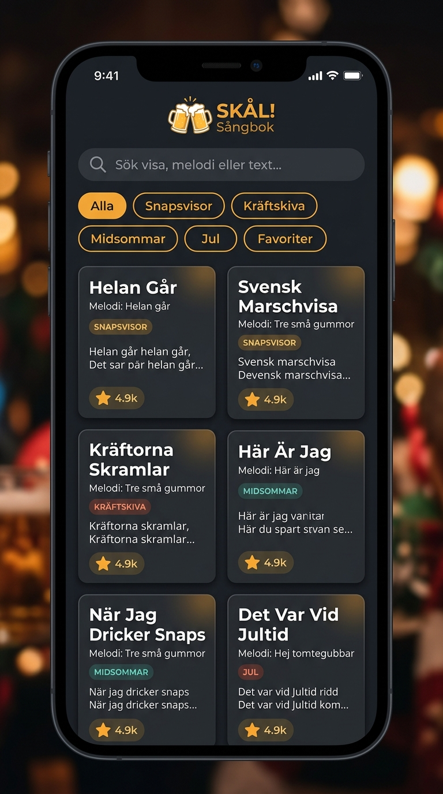
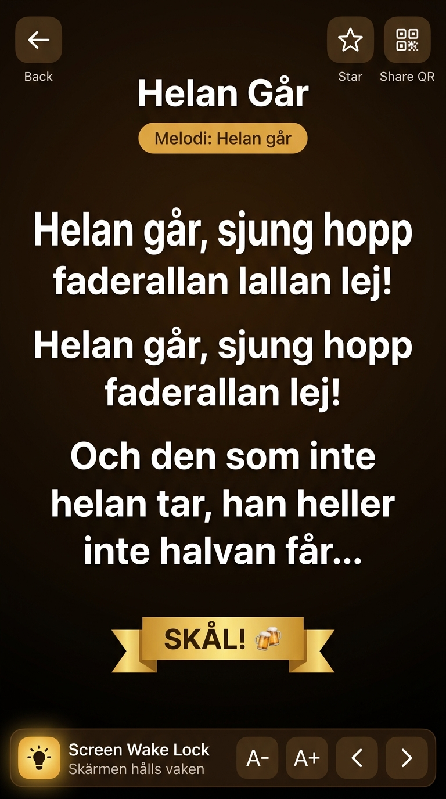
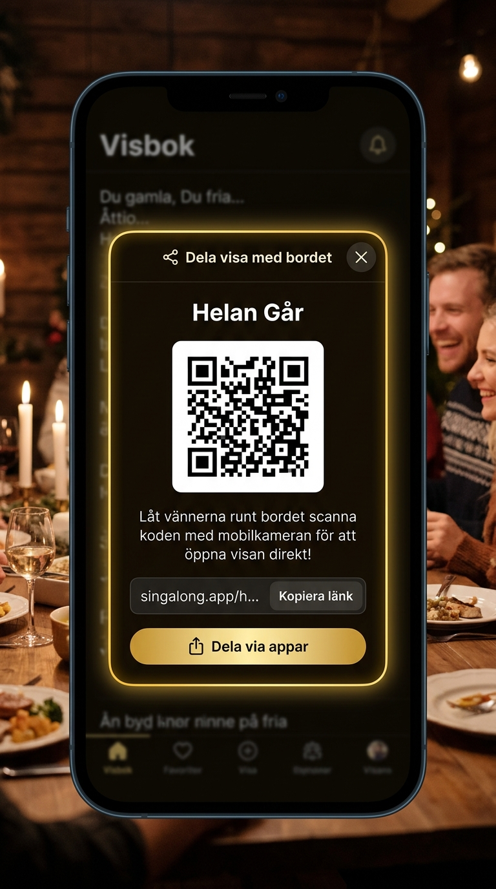
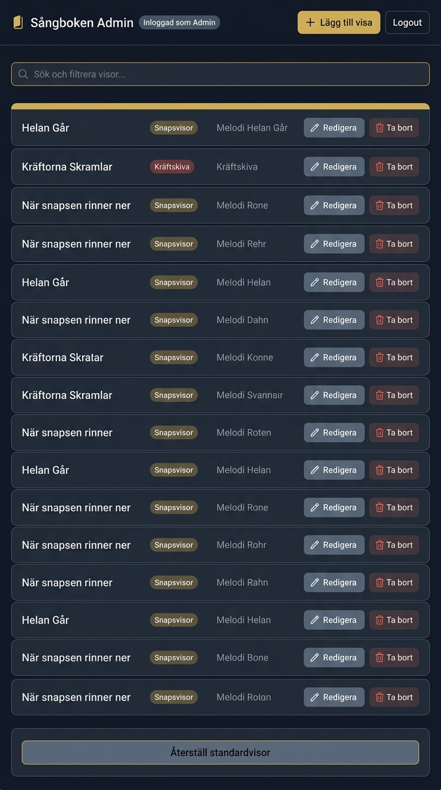
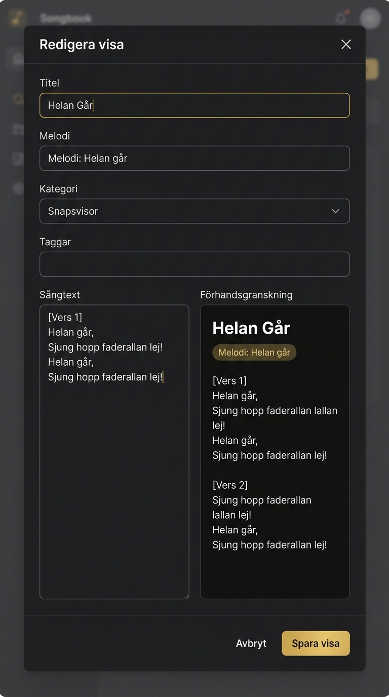
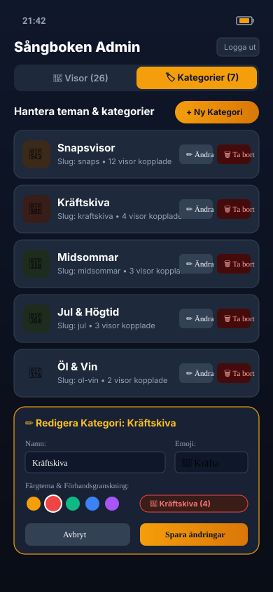

# Project Wireframes: Digital Sångbok

This directory contains the 5 core UI wireframe designs for the **Digital Sångbok** web application.

---

## 1. Catalog View (Home Page)
**File:** [`01-catalog-view.jpg`](./01-catalog-view.jpg)

The primary landing view for party guests on mobile devices.
- **Header:** App branding ("Uddmans bästa snapsvisor!"), dark/light theme switch, favorites counter, and admin link.
- **Search Bar:** Instant live search field (*"Sök visa, melodi eller text..."*).
- **Category Filter Pills:** Horizontally scrollable chips (`Alla`, `Snapsvisor 🥃`, `Kräftskiva 🦞`, `Midsommar 🌸`, `Jul 🎄`, `⭐ Mina favoriter`).
- **Song Cards:** Displays song title, melody badge (`Melodi: ...`), category tag, opening 2-line lyric preview, and quick star favorite button.

---

## 2. Sing-Along Lyric View
**File:** [`02-lyric-view.jpg`](./02-lyric-view.jpg)

The focused singing experience optimized for dim dinner environments, one-handed phone holding, and group singalongs.
- **Top Bar:** Back button, Song Title, Star Favorite toggle, and Table QR share button.
- **Melody Pill:** Prominently displays the original melody (e.g., `Melodi: Helan går`).
- **Lyric Canvas:** Large high-contrast text with clear verse spacing.
- **Toast Banner:** Celebratory banner (*"SKÅL! 🍻"*).
- **Sticky Sing-Along Toolbelt:**
  - **Screen Wake Lock Status:** `💡 Skärmen hålls vaken` (keeps screen active during singing).
  - **Font Size Stepper:** `A-` / `A+` buttons for instant text scaling.
  - **Navigation Controls:** `‹` Previous and `›` Next song buttons.

---

## 3. Table QR Code & Quick Share Modal
**File:** [`03-qr-modal.jpg`](./03-qr-modal.jpg)

Allows anyone at the dinner table to share their current song with table mates in seconds.
- **Modal Overlay:** Translucent dark frosted backdrop with focused card.
- **Scannable QR Code:** Centered, high-contrast QR code pointing directly to the song URL (`/visa/[slug]`).
- **One-Tap Link Copy:** Copy URL button with instant visual confirmation.
- **App Sharing:** Native Web Share API button (*"Dela via appar"*).

---

## 4. Admin Management Dashboard (`/admin`)
**File:** [`04-admin-dashboard.jpg`](./04-admin-dashboard.jpg)

The host/administrator management view for curating and organizing the song library.
- **Admin Header:** Admin status badge, `+ Lägg till visa` (Add Song) button, and Logout.
- **Search/Filter:** Instant filter across all songs in the database.
- **Song Table/List:** Displays Song Title, Category Badge, Melody, and Actions:
  - **Redigera (Edit):** Opens the song editor modal.
  - **Ta bort (Delete):** Safety confirmation dialog before deletion.
- **Factory Reset:** `Återställ standardvisor` button to restore initial curated catalog.

---

## 5. Admin Song Editor Modal with Live Preview
**File:** [`05-song-editor.jpg`](./05-song-editor.jpg)

The creation/editing interface featuring real-time lyric preview.
- **Metadata Fields:** Title, Melody name, Category selector dropdown, and Tags.
- **Lyrics Input:** Multi-line textarea for lyrics with verse breaks.
- **Live Preview:** Instant rendered preview matching the exact sing-along view styling.
- **Actions:** `Avbryt` (Cancel) and `Spara visa` (Save Song) buttons.

---

## 6. Admin Category Management (`/admin`)
**File:** [`06-admin-categories.svg`](./06-admin-categories.svg)

The administrative panel to manage, customize, add, edit, and delete song categories and occasions.
- **Tabs:** Switch between `🎵 Visor` and `🏷️ Kategorier`.
- **Category Rows:** Displays Emoji icon, Category Name, Slug, linked song count, and Edit ✏️ / Delete 🗑️ action buttons.
- **Category Form & Live Badge Preview:** Edit Name, Emoji icon (🥃, 🦞, 🌸, 🎄, 🍺, 🍾, etc.), Color badge theme (Amber, Red, Green, Blue, Purple), and description.
- **Safety Handling:** When deleting a category, prompts the host to safely reassign existing songs to avoid data loss.

