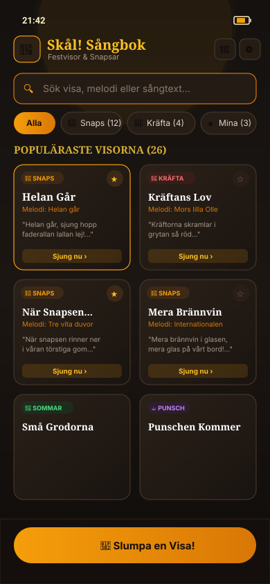
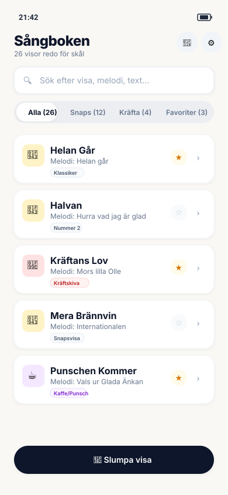
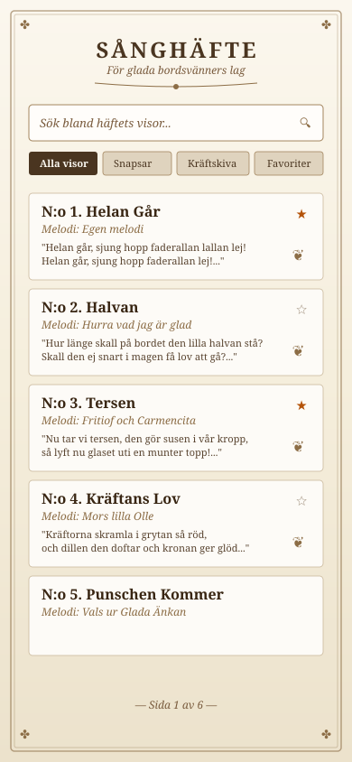
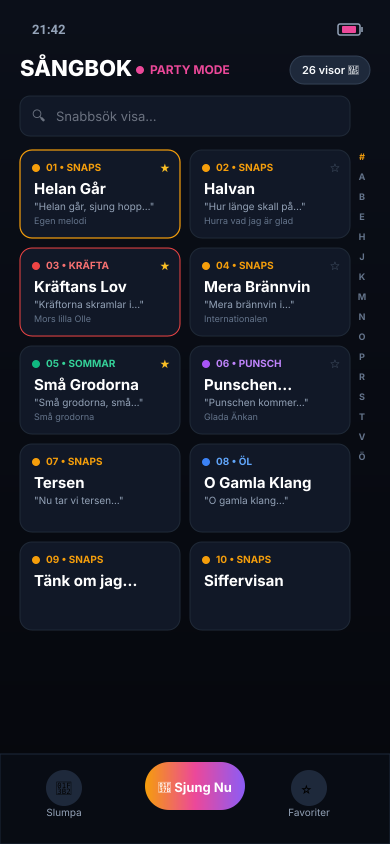
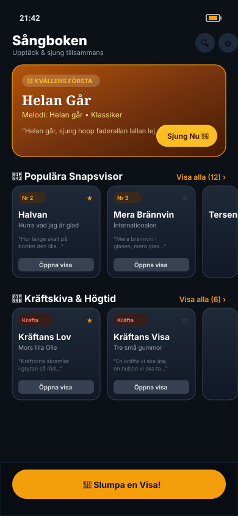

# Catalog / Home View Design Variations: Digital Sångbok

This directory showcases **5 distinct design concepts** for the main **Catalog / Home View** of the songbook app. Each variation approaches typography, hierarchy, layout density, and party atmosphere from a unique angle.

---

## Comparison Summary Table

| Concept | Aesthetic Theme | Layout Style | Key Strengths |
| :--- | :--- | :--- | :--- |
| **1. Nordic Tavern** | Warm Amber & Dark Slate | 2-Column Responsive Card Grid | Celebratory festive vibe, prominent gold star favorites, easy two-thumb browsing |
| **2. Scandinavian Minimalist** | Clean High-Contrast Light Mode | Single-Column Linear Card List | Ultra-clean, fastest one-hand scrolling at dinner tables, clear category badges |
| **3. Vintage Sånghäfte** | Parchment & Classic Serif | Traditional Printed Booklet Style | Authentic Swedish banquet booklet feel, numbered song entries, botanical dividers |
| **4. Party Compact Grid** | Night Mode Neon Accents | High-Density 2-Column Tiles | Maximum songs visible per screen, color-coded occasion dots, quick alphabet rail |
| **5. Magazine & Occasions** | Curated Thematic Showcase | Hero Banner + Horizontal Carousels | "Kvällens första snaps" spotlight, categorized occasion carousels (Snaps, Kräfta, etc.) |

---

## 1. Festive Nordic Tavern (Warm Amber & Dark Slate)
**File:** [`concept-1-nordic-tavern.svg`](./concept-1-nordic-tavern.svg) / [`concept-1-nordic-tavern.jpg`](./concept-1-nordic-tavern.jpg)

- **Vibe:** Warm, cozy, festive tavern atmosphere with rich amber highlights and dark obsidian cards.
- **Header:** "Skål! Sångbok" branding with toast beer icon, live search input with golden glow.
- **Filters:** Horizontal pill chips (`Alla`, `Snaps 🥃`, `Kräftskiva 🦞`, `Midsommar 🌸`, `Favoriter ⭐`).
- **Cards:** 2-column card grid showing title, melody subtitle, category badge, 2-line lyric preview snippet, star favorite toggle, and "Sjung nu ›" action button.
- **Bottom:** Floating "🎲 Slumpa en Visa!" shuffle action button.

---

## 2. Modern Scandinavian Minimalist (Clean Linear List)
**File:** [`concept-2-scandinavian-minimalist.svg`](./concept-2-scandinavian-minimalist.svg)

- **Vibe:** Crisp, high-contrast, modern Scandinavian design with clean whites, subtle shadows, and dark slate typography.
- **Header:** "Sångboken" in bold modern sans-serif with theme switcher and active song counter.
- **Filters:** Segmented control bar (`Alla (26)`, `Snaps (12)`, `Kräfta (4)`, `Favoriter (3)`).
- **Cards:** Full-width single-column list items with large tap targets, category emoji icons, melody subtitles, occasion tags, star toggle, and chevron right navigation.
- **Bottom:** Minimalist floating action button for picking a random song.

---

## 3. Traditional Vintage Sånghäfte (Parchment & Serif Booklet)
**File:** [`concept-3-vintage-sanghafte.svg`](./concept-3-vintage-sanghafte.svg)

- **Vibe:** An authentic Swedish printed *sånghäfte* with warm aged parchment background, double border rules, corner ornaments, and classic serif typography.
- **Header:** "SÅNGHÄFTE – För glada bordsvänners lag" with decorative center flourish.
- **Filters:** Traditional ribbon badges (`Alla visor`, `Snapsar`, `Kräftskiva`, `Favoriter`).
- **Cards:** Numbered entries (`N:o 1. Helan Går`, `N:o 2. Halvan`, `N:o 3. Tersen`), italic melody indicators, full first stanza text previews, and vintage floral fleurons (❦).
- **Bottom:** Traditional page numbering footer (`— Sida 1 av 6 —`).

---

## 4. Party Compact Grid with Floating Toolbelt
**File:** [`concept-4-party-compact-grid.svg`](./concept-4-party-compact-grid.svg)

- **Vibe:** Energetic nightlife / party mode with deep midnight blacks and color-coded neon accents.
- **Header:** "SÅNGBOK • PARTY MODE" with live song counter badge.
- **Layout:** High-density 2-column compact grid showing song numbers (`01`, `02`, `03`...), color-coded occasion dots (Amber=Snaps, Red=Kräfta, Green=Sommar, Purple=Punsch, Blue=Öl), and quick melody labels.
- **Quick Index:** Alphabetical jump rail on the right (`#`, `A`, `B`, `H`, `K`, `M`, `N`, `P`, `S`, `T`...).
- **Bottom Bar:** 3-action sticky toolbelt (`🎲 Slumpa`, `🍻 Sjung Nu` primary neon button, `⭐ Favoriter`).

---

## 5. Magazine & Curated Occasions (Hero Banner & Carousels)
**File:** [`concept-5-magazine-sections.svg`](./concept-5-magazine-sections.svg)

- **Vibe:** Curated banquet experience highlighting specific moments of the evening.
- **Featured Hero Banner:** "🌟 KVÄLLENS FÖRSTA" spotlight card for the opening snaps (*Helan Går*) with one-tap "Sjung Nu 🍻" button.
- **Categorized Carousels:** Horizontal swipeable sections:
  - `🥃 Populära Snapsvisor (12)`
  - `🦞 Kräftskiva & Högtid (6)`
  - `🍺 Öl & Studentvisor (8)`
- **Bottom:** Sticky random song trigger bar.

